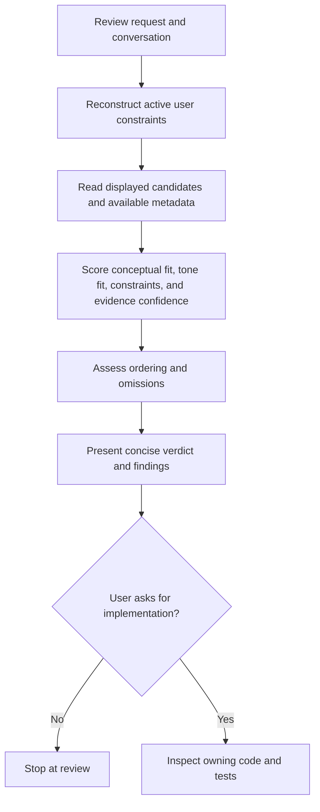

# Design: Recommendation Review Skill

## Overview

Create an on-demand VS Code Copilot skill at `.github/skills/recommendation-review/SKILL.md`. It reviews Lumera recommendation output against the user's active request and supporting catalog evidence. It is a review workflow, not an automatic ranking-code modifier.

## Goals

- Work for single-turn, composite, and multi-turn recommendation requests.
- Judge every title on independent request dimensions and assess the displayed ordering.
- Separate actual evidence from generated rationale and identify uncertainty.
- Produce concise, actionable review findings without inventing catalog or retrieval facts.
- Recommend implementation changes separately; make code changes only when asked.

## Architecture

The skill body contains all review steps and output requirements. No scripts or external API integrations are required. It may inspect existing workspace code, tests, API responses, retrieval diagnostics, and catalog details when present, but it must not assume access to data that was not supplied or fetched.

## Inputs and Evidence Model

### Inputs

- Full visible user conversation relevant to the current recommendation round.
- Current list of titles, ranks, and supplied explanations.
- Available synopsis, genres, metadata, scores, and retrieval diagnostics.
- Optional candidate pool, source responses, or tests provided by the user.

### Active-request state

Track user-originated signals as constraints with their latest status:

- `active`: still applies.
- `added`: introduced in a later turn and applies alongside compatible prior signals.
- `narrowed`: refines an active signal.
- `replaced`: explicitly superseded; do not carry forward.
- `unclear`: conversational turn semantics cannot be established confidently; state the assumption or ask a brief question.

Assistant suggestions and generated explanations are never user constraints unless the user adopts them.

### Evidence priority

1. Supplied title synopsis and catalog metadata.
2. Supplied ranking scores, diagnostics, or candidate-pool evidence.
3. User-provided observations and candidate titles.
4. General film knowledge only when stated with appropriate uncertainty and, where available, verified against workspace/catalog evidence.

An explanation string is a claim to audit, not evidence supporting itself. Popularity is catalog confidence, not conceptual fit. Genre overlap is a weak signal unless supported by premise or other request dimensions.

## Review Procedure

1. Restate the active request dimensions briefly, including how later turns add, narrow, or replace earlier constraints.
2. For each displayed recommendation, independently assess:
   - Reference/concept fit.
   - Fit to each explicit genre, person, era, format, or exclusion.
   - Requested tone fit, including positive cues and contradictions such as violence, urgency, stakes, or emotional heaviness.
   - Evidence confidence and any unknowns.
3. Assess ordering: identify whether stronger candidates rank below weaker or contradictory ones. Do not treat merely eligible as top-tier.
4. Assess omissions only against known candidates or verifiable catalog evidence. When source/candidate-pool data is missing, say that it is unknown whether a title was retrieved or excluded.
5. Summarize the main failure stage only when evidence supports one: interpretation, retrieval, filtering, scoring/order, or explanation. Otherwise report it as undiagnosed.
6. End with a concise verdict and, when useful, a few concrete ranking or retrieval implications. Do not silently implement them.

## Output Format

- Overall verdict: good, mixed, or poor fit, with the primary reason.
- Compact table for longer lists with rank, title, conceptual fit, requested-dimension fit, and assessment.
- Strongest matches and weakest/contradictory placements.
- Defensible omissions and evidence status, if relevant.
- Likely failure stage and targeted next check, if determinable.

Avoid ceremonial praise, unsupported details, fake citations, and false precision. Do not infer exact pacing from genre alone; qualify tone judgments derived only from a short synopsis.

## Configuration and Placement

- Skill name/folder: `recommendation-review`.
- File: `.github/skills/recommendation-review/SKILL.md`.
- Frontmatter must have a matching lowercase name and a concise, keyword-rich description mentioning recommendation review, ranking assessment, composite prompts, and multi-turn refinement.
- Use default auto-invocation and slash-command availability unless repository conventions or user preference indicate otherwise.
- Keep the workflow self-contained and below the skill-size guidance; no auxiliary scripts are needed.

## Non-Functional Requirements

- No credentials, external service calls, or environment dependencies.
- Must work if the optional LLM is unavailable.
- Read-only by default; no application code changes during a review.
- Clear uncertainty rather than fabricate source data, candidate-pool history, or model behavior.
- Applicable beyond the Inception example without hard-coded genre bans or a memorized title list.

## Validation Plan

After implementation:

1. Check skill frontmatter syntax, matching folder/name, description discoverability, and file placement.
2. Walk the workflow against a single-turn reference-plus-mood prompt, a composite genre/person/era prompt, and a multi-turn refinement followed by an explicit pivot.
3. Confirm it distinguishes conceptual fit from tone fit, audits generated rationales, and does not revive replaced constraints.
4. Confirm it reports unknown retrieval causes as unknown and does not edit code absent authorization.

## Kiro-Lite State

Phase 1 design drafted. Await `/approve design` before creating `tasks.md` or implementing `.github/skills/recommendation-review/SKILL.md`.
